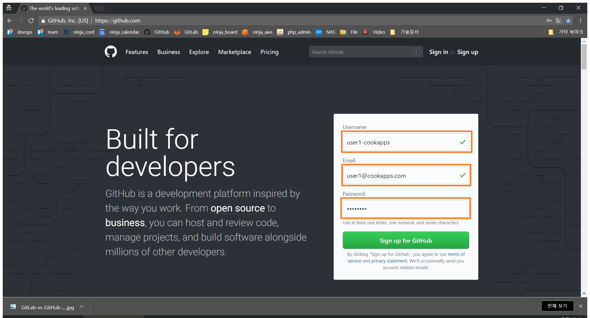
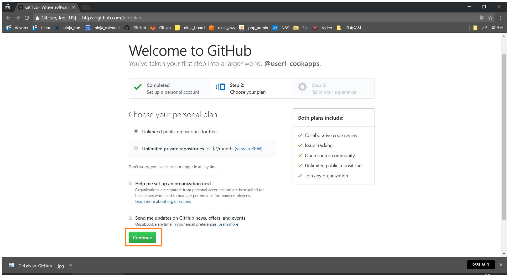
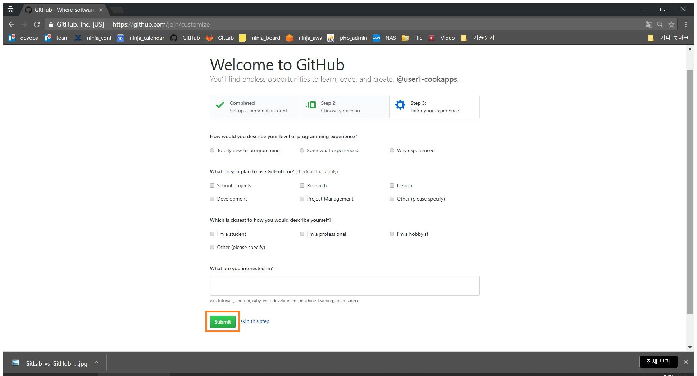
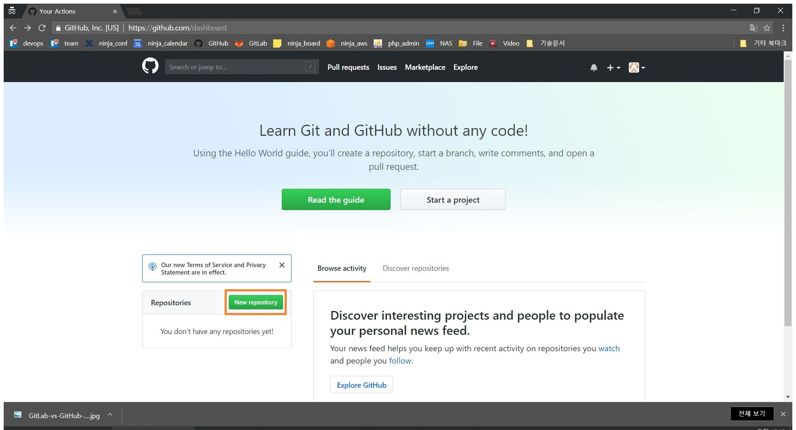
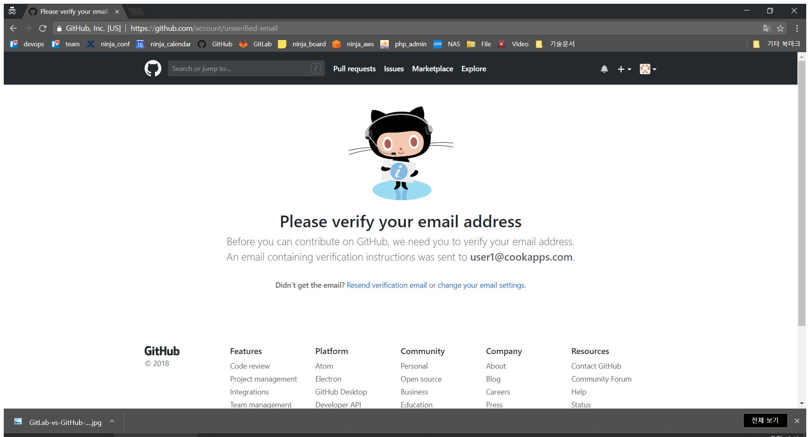
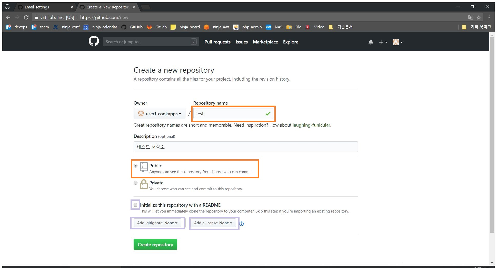
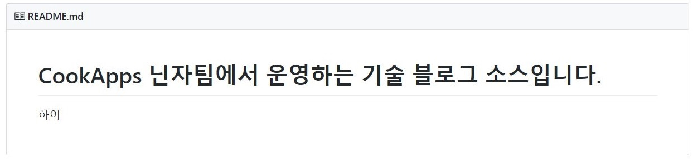
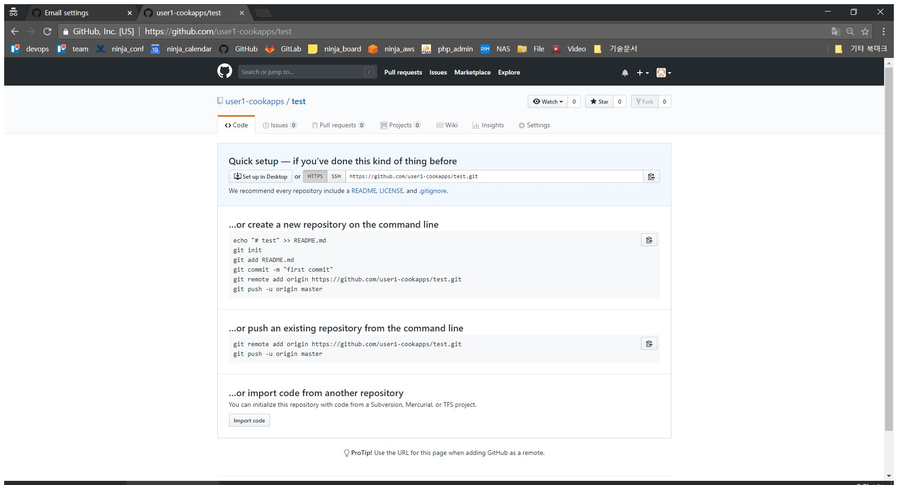
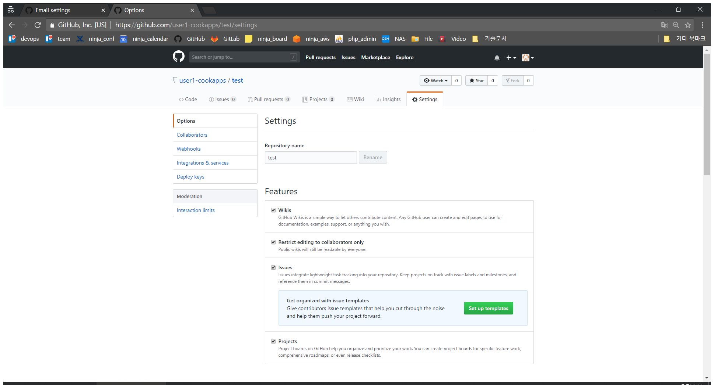
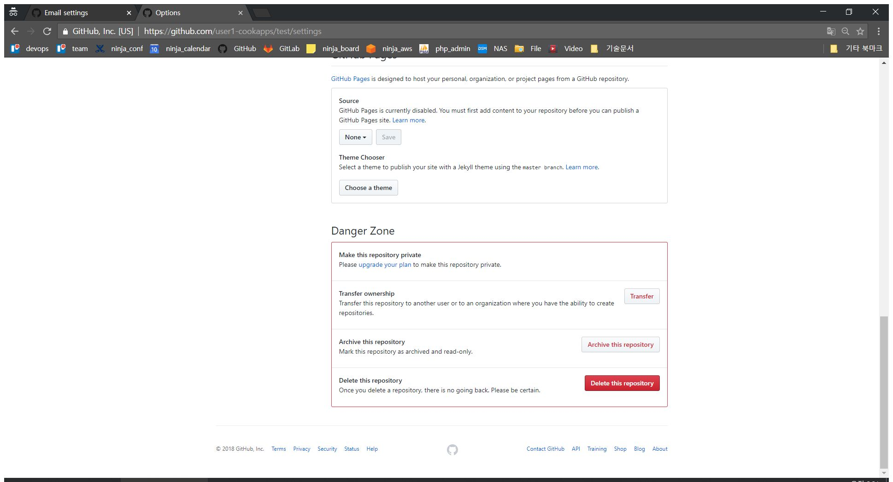

## GITHUB
널리 세상을 이롭게한 킹갓 GIT 호스팅.\
최근 MS에서 인수한뒤 잔치집 분위기.

## 계정 생성
- https://github.com/에 접속하자 [링크](https://github.com/)

- 강렬한 아이디를 만들어 보자. user1-cookapps

- 이건 그냥 넘어가자

- 너무나도 환영해서 직업을 물어보는 GITHUB!

## repository 생성하기

- git을 사용하려면 **repository** 라는 저장소를 생성해야 한다. 버튼 클릭  

- 앗! 아아... 환영하지만 인증은 별개란다 아가야\
가서 인증하고 오자.

- 인증하고 다시 위 단계를 거듭하면 이런게 나온다.
    * Repository name : 적당히.
    * public : 무료 유저는 선택권 따위 없다.
    * Initialize this repository with a README : 저장소 메인 페이지에 들어갈 설명 문서 추가.
    \
    익숙한 그 문서이다. 보기보다 꿀기능이 많으니 시간되면 알아보자. [링크](https://www.google.co.kr/search?q=github+readme+%EC%9E%91%EC%84%B1&sa=X&ved=0ahUKEwiQt_a20KbcAhUFUt4KHe3hBoQQ1QIIrQEoAA&biw=1536&bih=732)
    * ADD .gitignore : github 저장소에 넣지 파일을 명시하는 파일이다. 일단무시!
    * ADD a license : 프로젝트의 라이센스를 지정. 특별한게 없으면 MIT다.

\
어때요, 참 쉽죠?\
커맨드라인 한줄 없이 원격지에 git 저장소를 생성했다.\
이제 어디서든 이 저장소 하나면 동료들과 일을 할수 있다!??

## repository 삭제하기

- 꽁꽁 숨겨놔서 찾기 어렵다. 여기에 있으니 알아두자.
\
